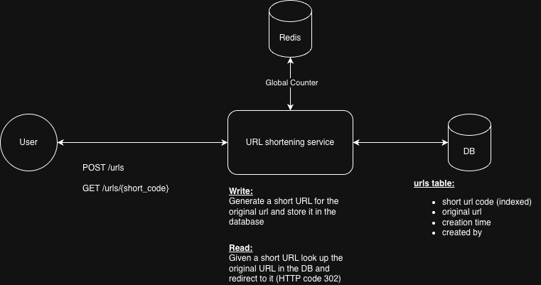

# 1. Record architecture decisions

Date: 07-November-2025

## Status

Accepted

## Context

The system architecture for the URL shortener with a global counter to improve the uniqueness of the short code over billions of URLs

## Decision

## Consequences

The uniqueness of the short URLs now spans billions of URLs

## Made by

Mahan Hashemizadeh